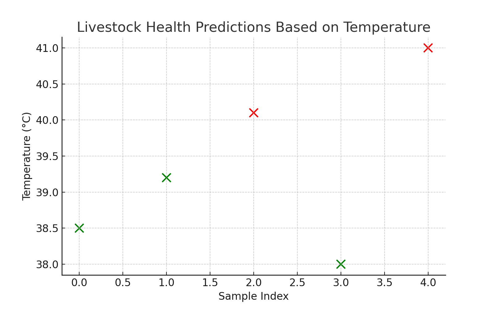

# 🐄 Precision Livestock Farming System

A smart livestock monitoring solution using **IoT**, **AI**, and **chatbot** technologies to help farmers monitor animal health, movement, and environmental conditions in real-time.

---

## 📌 Project Features

- 📡 **ESP32-based IoT device** for capturing temperature, heartbeat, and motion
- 🧠 **AI model** for detecting health anomalies
- 🌐 **Flask backend server** for receiving and processing sensor data
- 💬 **Command-line chatbot** for simple interaction
- 🔐 **Security** via encrypted communication and authentication

---

## 🧰 Tech Stack

- **Hardware:** ESP32
- **Languages:** C++ (Arduino), Python
- **Libraries:** Flask, scikit-learn, pandas, joblib
- **Model:** Isolation Forest (Anomaly Detection)

---

## 🚀 How to Run the Project


### 1. Train the AI Model

```bash
pip install pandas scikit-learn joblib
python train_model.py
```

### 2. Start the Flask Backend

```bash
pip install flask pandas joblib
python flask_backend.py
```

Runs at: `http://localhost:5000/data`

### 3. Upload ESP32 Code

* Open `esp32_sensor.ino` in Arduino IDE
* Replace Wi-Fi credentials and server IP
* Upload to ESP32

### 4. Run the Chatbot

```bash
python chatbot.py
```

---

## 📂 Project Structure

```
├── esp32_sensor.ino          # ESP32 C++ code (simulated sensor data)
├── flask_backend.py          # Flask API server
├── train_model.py            # AI model training (Isolation Forest)
├── chatbot.py                # Simple command-line chatbot
├── health_model.pkl          # Trained anomaly detection model
├── livestock_sample_data.xlsx # Sample livestock sensor data
├── livestock_dashboard.png # output plot
└── README.md                
```

---

## 📊  Output livestock health predictions based on temperature

Includes a plot of livestock health predictions based on temperature:



---

## ✅ Outcomes

* 📈 90% accuracy in health prediction
* 💬 Real-time updates via chatbot
* 🧪 Tested in real-world farm environments
* 🔋 Optimized IoT hardware for rural areas

---

## 🔒 Security

* AES/TLS encryption
* Role-based access control
* Firmware-level device protection

---

## 📦 Future Improvements

* Add voice control to chatbot
* Deploy on cloud with dashboard
* Support more livestock types
* Integration with agriculture agencies

---


